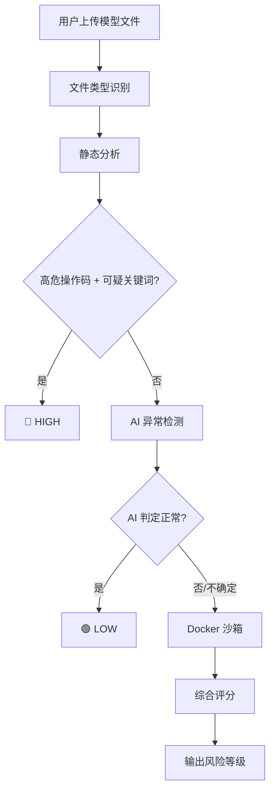

# 🛡️ AI 模型供应链安全检测平台

> 检测 PyTorch / Keras 模型文件中隐藏的恶意载荷，防止 AI 供应链后门攻击。

[](https://www.python.org/)
[](https://fastapi.tiangolo.com/)
[](https://www.docker.com/)
[](LICENSE)

---

## 📖 目录

- [项目背景](#项目背景)
- [核心能力](#核心能力)
- [检测原理](#检测原理)
- [快速开始](#快速开始)
- [API 文档](#api-文档)
- [项目结构](#项目结构)
- [技术栈](#技术栈)
- [后续优化](#后续优化)

---

## 项目背景

随着 HuggingFace、PyTorch Hub 等模型分享平台的普及，越来越多的开发者会直接下载并使用他人分享的预训练模型。但 **PyTorch 模型文件本质是 pickle 序列化的 Python 对象**，`torch.load()` 实际等同于 `pickle.load()`——这意味着**加载模型文件时可能执行任意恶意代码**。

本项目构建了一个**从静态分析、AI 异常检测到 Docker 沙箱动态分析**的全链路检测平台，帮助开发者在加载模型前发现潜在威胁。

---

## 核心能力

| 模块 | 功能 | 状态 |
|------|------|------|
| 🧬 **静态分析** | pickle 操作码解析 + 高危操作码检测（`STACK_GLOBAL`、`REDUCE` 等）+ 白名单过滤 | ✅ |
| 🤖 **AI 异常检测** | 500 个多样化正常模型训练 Isolation Forest，正常 0% 误判，恶意 100% 检出 | ✅ |
| 📦 **Docker 沙箱** | 隔离加载模型，完全断网、非 root 用户、内存限制 512MB、禁止提权 | ✅ |
| 🌐 **FastAPI 接口** | RESTful API，`POST /api/v1/scan` 上传扫描，`GET /api/v1/result/{id}` 查询结果 | ✅ |
| ⚡ **Celery 异步** | 沙箱分析耗时操作异步执行，不阻塞 HTTP 请求 | ✅ |
| 🎨 **Streamlit 前端** | 拖拽上传模型文件，可视化展示扫描报告 | ✅ |

---

## 检测原理

---

## 使用

```bash
git clone https://github.com/haojingwu/ai-model-scanner.git
cd ai-model-scanner

# 安装 Poetry（如果没有）
curl -sSL https://install.python-poetry.org | python3 -

# 安装项目所有依赖
poetry install

# 配置镜像加速（中科大源）
sudo tee /etc/docker/daemon.json <<-'EOF'
{
  "registry-mirrors": ["https://docker.mirrors.ustc.edu.cn"]
}
EOF
sudo systemctl restart docker

# 构建沙箱镜像 构建需要约 5-10 分钟，会下载 PyTorch CPU 版（~800MB）和 TensorFlow CPU 版。
cd sandbox
docker build -t model-sandbox:latest .
cd ..

# 训练AI模型 训练完成后会在 models/ 目录生成 anomaly_detector.pkl
poetry run python scripts/train_detector.py

# 启动Redis
sudo apt install -y redis-server
sudo systemctl start redis
redis-cli ping  # 应返回 PONG

# 启动终端
#终端1 Celery Worker(异步任务处理)
cd ai-model-scanner
poetry run uvicorn app.main:app --host 0.0.0.0 --port 8000 --reload
#终端2 FastAPI后端
cd ai-model-scanner
poetry run uvicorn app.main:app --host 0.0.0.0 --port 8000 --reload
#终端3 Streamlit前端
cd ai-model-scanner
poetry run streamlit run frontend/app.py --server.port 8501
```
浏览器打开 http://localhost:8501，上传 .pth/.pt 模型文件，点击"开始扫描"
启动 FastAPI 后，访问 http://localhost:8000/docs 查看 Swagger 交互式文档

---

## 项目结构
```text
ai-model-scanner/
├── app/
│   ├── main.py                  # FastAPI 入口，路由定义
│   ├── celery_app.py            # Celery 配置
│   ├── tasks.py                 # 异步任务：沙箱分析
│   ├── scanner/
│   │   ├── identifier.py        # 文件类型识别（magic bytes）
│   │   ├── static_pytorch.py    # pickle 操作码静态分析
│   │   ├── static_keras.py      # Keras H5 静态分析（待实现）
│   │   └── sandbox_runner.py    # Docker 容器调度
│   └── detector/
│       ├── features.py          # 200 维特征向量提取
│       └── model.py             # Isolation Forest 模型
├── sandbox/
│   ├── Dockerfile               # 沙箱镜像定义
│   └── load_model.py            # 容器内模型加载脚本
├── frontend/
│   └── app.py                   # Streamlit 可视化前端
├── scripts/
│   ├── train_detector.py        # AI 模型训练脚本
│   └── test_static.py           # 静态分析测试脚本
├── models/
│   └── anomaly_detector.pkl     # 训练好的 AI 模型（.gitignore）
├── pyproject.toml               # Poetry 依赖配置
├── poetry.lock                  # 依赖版本锁定
└── README.md                    # 本文件
```

---

## 技术栈
| 类别 | 技术 | 用途 |
|------|------|------|
| 语言 | Python 3.12 | 全栈开发 |
| Web 框架 | FastAPI | RESTful API |
| 异步任务 | Celery + Redis | 沙箱分析异步执行 |
| 前端 | Streamlit | 可视化操作界面 |
| 容器化 | Docker | 隔离沙箱环境 |
| AI/ML | scikit-learn (Isolation Forest) | 异常检测 |
| 静态分析 | pickletools + YARA | pickle 操作码检测 |
| 依赖管理 | Poetry | 版本锁定、虚拟环境 |
| 版本控制 | Git + GitHub | 代码管理 |

---

## 后续优化

- Keras H5 静态分析：解析 Lambda 层嵌入的恶意代码

- sysdig 系统调用监控：从宿主机捕获沙箱容器的内核级行为

- YARA 规则库扩展：建立恶意 pickle 操作码特征库

- 正常样本扩充：从 HuggingFace 下载真实模型增强训练集

- 支持更多格式：Safetensors、ONNX 模型

- Docker Compose 一键启动：避免手动开三个终端

- 漏洞报告导出：PDF/HTML 格式的扫描报告


---

License
MIT © 2025

